<h1 class="mainTitle">The Anatomy of an HTTP request</h2>

---

## Who am I?

----

### Addison Higham

Shared services nomad

---

## Let's __really__ understand how HTTP works

----

## Meme Generation as a Service

  
  + Bottom Text + Top Text =
  

---

# HTTP
#### Hypertext Transfer Protocol

----

## What HTTP Is

- Gives us nice semantics for requests and responses <!-- .element: class="fragment" data-fragment-index="1" -->
- Verbs, Paths and Headers give us a way of modeling APIs <!-- .element: class="fragment" data-fragment-index="2" -->

----

## What a request looks like

<pre><code class="lang-http" style="font-size: 0.8em; line-height: 1.2em" data-trim data-noescape>
POST /meme HTTP/1.1
Host: www.memegen.tld
Content-Type: application/json
Content-Length: 2048

{"image": "...", "topText": "My First Meme", "bottomText": "Isn't Really Good"}
</code></pre>

This isn't <em>completely</em> accurate, HTTP uses a <code>\r\n</code> as a newline

----

## And a response

<pre><code class="lang-http" style="font-size: 0.8em; line-height: 1.2em" data-trim data-noescape>
HTTP/1.1 200 OK
Content-Type: image/jpeg
Content-Length: 2048

/9j/4AAQSkZJRgABAQEAYABgAAD/2wBDAAgGBgcGBQgHBwcJCQgKDBQ...
</code></pre>

----

## In Code

<pre><code class="lang-javascript" style="font-size: 0.8em; line-height: 1.2em" data-trim data-noescape>
const net = require('net')
const jsonBody = '{"image": ...}'
const headers = [ 'POST /meme HTTP/1.1', ...]

const socket = net.connect(80, 'www.memegen.tld')
socket.on('connect', () => {
  headers.forEach((header) => socket.write(header + '\r\n')
  socket.write('\r\n')
  socket.write(jsonBody)
})
socket.on('data', (d) => console.log(d))
socket.on('close', () => console.log('\n\nfinished!'))
</code></pre>

----

## In Summary...

HTTP is a message orientied protocol that takes a verb, an action, headers, and a body as a request.

It sends that data to a server, and
the server returns with a response that includes a status code, headers, and a body.

----

## That's it!
### HTTP is so simple!

----

## Right?
### Well... A few questions still remain

<ul>
<li class="fragment" data-fragment-index=1>What is that <code>socket</code> objects and why do we wait for a connection?</li>
<li class="fragment" data-fragment-index=2>How do we find the server we want to talk to?</li>
<li class="fragment" data-fragment-index=3>Can we really send very large images this way with no changes?</li>
<li class="fragment" data-fragment-index=4>How about missed messages, errors, corrupted data, etc?</li>
<li class="fragment" data-fragment-index=5>How does the data actually get sent over the internet?</li>
</ul>

---

# TCP
### Transmission Control Protocol

----

## HTTP assumes, but does not directly care about

- Messages actually arriviving
- Messages remaining free of corruption
- How messages get sent over the internet

----

## What TCP is

- Provides a persistent connection that we can logically reason about <!-- .element: class="fragment" data-fragment-index="1" -->
- Doesn't care about messages or formats, it is just streams of bytes <!-- .element: class="fragment" data-fragment-index="2" -->
- Ensures those streams of bytes all arrive in order and tries to detect corruption <!-- .element: class="fragment" data-fragment-index="3" -->
- Doesn't care about who is talking and when (full-duplex) <!-- .element: class="fragment" data-fragment-index="4" -->

----

## The TCP Datagram

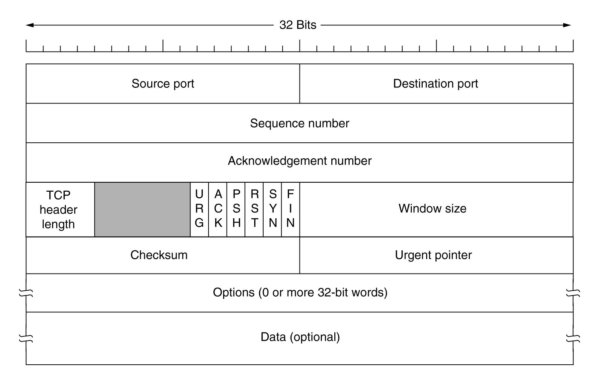

Note: sequence number is the number of the first byte, ack number is if we are ackknowleding a byte, window is for communicating buffer sizes, checksum for consistency, options for a range of things, offset for how big the TCP header is

----

## The TCP Session

----

## The TCP Socket

----

## In Code

<em>Well... at least the first packet of the handshake...</em>

<pre><code class="lang-javascript" style="font-size: 0.35em; line-height: 1.2em" data-trim data-noescape>
const raw = require('raw-socket')
const ip = require('ip')

function sendSyn(srcIp, srcPort, destIp, destPort) {
  const socket = raw.createSocket({protocol: raw.Protocol.TCP, addressFamily: raw.AddressFamily.IPv4})
  const tcpBuffer = Buffer.from([
    0x00,0x00,              // TCP: src port (should be random)
    0x00,0x00,              // TCP: dst port (should be the port you want to connect to)
    0x00,0x00,0x00,0x00,    // TCP: sequence number (should be random)
    0x00,0x00,0x00,0x00,    // TCP: acquitment number (must be null because WE are intiating the SYN, static value)
    0x00,0x02,              // TCP: header length (data offset) && flags (fin=1,syn=2,rst=4,psh=8,ack=16,urg=32, static value)
    0x72,0x10,              // TCP: window
    0x00,0x00,              // TCP: checksum for TCP part of this packet)
    0x00,0x00,              // TCP: ptr urgent
    0x02,0x04,              // TCP: options
    0x05,0xb4,              // TCP: padding (mss=1460, static value)
    0x04,0x02,              // TCP: SACK Permitted (4) Option
    0x08,0x0a,              // TCP: TSval, Length
      0x01,0x75,0xdd,0xe8,  // value
      0x00,0x00,0x00,0x00,  // TSecr
    0x01,                   // TCP: NOP
    0x03,0x03,0x07          // TCP: Window scale
 ])

  tcpBuffer.writeUInt32BE(parseInt(Math.random()*0xffffffff), 4) // TCP: create random sequence number
  tcpBuffer.writeUInt8(tcpBuffer.length << 2, 12) // TCP: write Header Length
  tcpBuffer.writeUInt16BE(srcPort, 0) // TCP: save src port into the buffer
  tcpBuffer.writeUInt16BE(destPort, 2) // TCP: save dst port into the buffer

  const pseudoBuffer = new Buffer.from([
    0x00,0x00,0x00,0x00,    // IP: ip src
    0x00,0x00,0x00,0x00,    // IP: ip dst
    0x00,
    0x06, // IP: protocol (ICMP=1, IGMP=2, TCP=6, UDP=17, static value)
    (tcpBuffer.length &gt&gt;; 8) & 0xff, tcpBuffer.length & 0xff
  ])
  ip.toBuffer(srcIp, pseudoBuffer, 0) // IP: save ip src into the buffer
  ip.toBuffer(destIp, pseudoBuffer, 4) // IP: save ip dst into the buffer
  pseudoBuffer = Buffer.concat([pseudoBuffer, tcpBuffer])

  raw.writeChecksum(tcpBuffer, 16, raw.createChecksum(pseudoBuffer))
  socket.send(tcpBuffer, 0, tcpBuffer.length, destIp)

  // and that was just to send the first packet...
}
</code></pre>

----

## Where does that get us?

Now with a TCP session established we have:

- A way of reliably sending and recieving data
- Something that gurantees order and that we are reasonably confident hasn't been corrupted
- An API to program against that is easy to reason about

----

## In Summary

HTTP is a message orientied protocol that is encapsulated by TCP, a connection-oriented protocol that allows for getting ordered streams of bytes.

TCP ensures that all messages arrive in order and can detect most corruption.

HTTP uses TCP to send messages that takes a verb, an action, headers, and a body as a request.

It sends that data to a server, and the server returns with a response that includes a status code, headers, and a body.

----

## That's it!
### HTTP and TCP is fairly simple!

----

## Right?
### Well... We still don't know

<ul>
<li class="fragment" data-fragment-index=1>How do we find the server we want to talk to?</li>
<li class="fragment" data-fragment-index=2>How does the data actually get sent over the internet?</li>
</ul>

---

# IP
### Internet Protocol

----

## TCP assumes, but does not directly care about

- Addressing
- Routing
- How TCP streams get sent over the internet

----

## What IP is

<ul>
<li class="fragment" data-fragment-index=1>Provides a mechanism for specifying the final destination of traffic</li>
<li class="fragment" data-fragment-index=2>Gives us tools to reason about how to segment and route traffic</li>
<li class="fragment" data-fragment-index=3>Does not care about connections or streams, you just send messages</li>
</ul>

----

## The IP Packet

Note: version is ipv4, IHL is the length of IP header, type of service is for QoS, identifcation for splitting packets

----

## What is the internet anyway?

We often think of the internet as a _network_ but in reality, it is a recursive network, with networks inside networks inside networks

----

## Addressing

This network of networks has private networks, which share address space, and public networks that must have unique addresses

IP addresses give us a destination, but by themselves, they aren't enough to give us a path to get there

----

## Aside: DNS

DNS is critical to the operation of the internet, but in some respects, it is a totally seperate system

If the internet is a library, then DNS is a card catalog

----

## Route Tables

Provide information on the next hop

<pre><code class="lang-bash" style="font-size: 0.9em; line-height: 1.2em" data-trim data-noescape>
$ ip route
default via 10.0.8.1 dev enx00e11f0005f3 proto dhcp metric 100
default via 10.0.8.1 dev wlp2s0 proto dhcp metric 600
10.0.8.0/21 dev enx00e11f0005f3 proto kernel scope link src 10.0.13.191 metric 100
10.0.8.0/21 dev wlp2s0 proto kernel scope link src 10.0.13.209 metric 600
169.254.0.0/16 dev enx00e11f0005f3 scope link metric 1000
172.17.0.0/16 dev docker0 proto kernel scope link src 172.17.0.1 linkdown
172.18.0.0/16 dev br-aaec6a8da6fc proto kernel scope link src 172.18.0.1 linkdown
</code></pre>

----

## Aside: NAT

In most IPv4 networks, NAT is used to translate between local and remote networks.

It rewrites IP packets to be the correct source/destination IPs and tracks the state of TCP flows to do this.

----

## In Code (with some details removed...)

<em>Still for just the first packet... and with more details removed...</em>

<pre><code class="lang-javascript" style="font-size: 0.35em; line-height: 1.2em" data-trim data-noescape>
const raw = require('raw-socket')
const ip = require('ip')

function genTcp(srcIp, srcPort, destIp, destPort) {...}

function sendSyn(srcIp, srcPort, destIp, destPort) {
  const socket = raw.createSocket({protocol: raw.Protocol.TCP, addressFamily: raw.AddressFamily.IPv4})
  const ipBuffer = Buffer.from([
    0x45,                   // IP: Version (0x45 is IPv4)
    0x00,                   // IP: Differentiated Services Field
    0x00,0x3c,              // IP: Total Length
    0x00,0x00,              // IP: Identification
    0x40,                   // IP: Flags (0x20 Don't Fragment)
    0x00,                   // IP: Fragment Offset
    0x40,                   // IP: TTL (0x40 is 64)
    0x06,                   // IP: protocol (ICMP=1, IGMP=2, TCP=6, UDP=17, static value)
    0x00,0x00,              // IP: checksum for IP part of this packet
    0x00,0x00,0x00,0x00,    // IP: ip src
    0x00,0x00,0x00,0x00,    // IP: ip dst
  ])

  ipBuffer.writeUInt16BE(parseInt(Math.random()*0xffff), 4) // IP: set identification
  ip.toBuffer(src_ip, ipBuffer, 12) // IP: save ip src (src_ip var) into the buffer
  ip.toBuffer(dst_ip, ipBuffer, 16) // IP: save ip dst (dst_ip var) into the buffer
  raw.writeChecksum(ipBuffer, 10, raw.createChecksum(ipBuffer))

  function beforeSend() {
    socket.setOption(
      raw.SocketLevel.IPPROTO_IP,
      raw.SocketOption.IP_HDRINCL,
      new Buffer ([0x00, 0x00, 0x00, 0x01]),
      4
    )
  }
  const tcpBuffer = genTcp(srcIp, srcPort, destIp, destPort)
  const buffer = Buffer.concat([ipBuffer, tcpBuffer])
  socket.send(buffer, 0, buffer.length, destIp, beforeSend);

  // and that was just to send the first packet...
}
</code></pre>

----

## In Summary (Part 1)

HTTP is a message orientied protocol that is encapsulated by TCP, a connection-oriented protocol that allows for getting ordered streams of bytes, which is encapsulated by IP, a message orientied protocol.

IP gives us a mechanism for addressing and some routing and is corruption resistant.

----

## In Summary (Part 2)

TCP ensures that all messages arrive in order and can detect most corruption.

HTTP uses TCP to send messages that takes a verb, an action, headers, and a body as a request.

It sends that data to a server, and the server returns with a response that includes a status code, headers, and a body.

The messages are directed to their final destination by IP packets with routing tables helping to find paths.

Other things, like DNS and NAT help do all this.

----

## That's it!
### HTTP, TCP and IP are complex, but understandable

----

## Right?
### Well... We still don't know

- How does data get sent in between intermediate machines?
- How does the data actually get sent over the internet?

---

# Ethernet

----

## IP assumes, but does not directly care about
- How messages are sent from one node to the next
- How messages are actually sent over a wire

----

## What Ethernet is

<ul>
<li class="fragment" data-fragment-index=1>Provides a mechanism for communicating with the next node</li>
<li class="fragment" data-fragment-index=2>Provides the basics for we send over a wire</li>
</ul>

----

## The Ethernet Frame

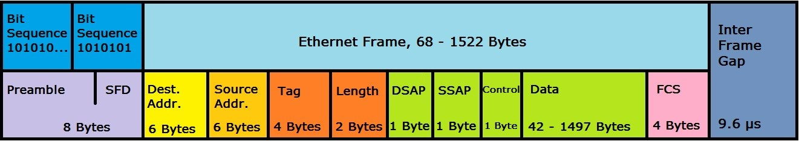

Note: the preamble is some patterned bytes so we can synchronize some recievers, dest and src macs, vlan tag, lengths, and even a gap

----

## Yet another address

IP addresses work great for the address of the internet... our final destination, but they don't tell us how to get to the next
node in our path. For that, we need another address, the MAC address

<pre><code class="lang-bash" style="font-size: 0.8em; line-height: 1.2em" data-trim data-noescape>
ip addr show wlp2s0
2: wlp2s0: &lt;BROADCAST,MULTICAST,UP,LOWER_UP&gt; mtu 1500 qdisc mq state UP group default qlen 1000
    link/ether 00:28:f8:b1:d9:e2 brd ff:ff:ff:ff:ff:ff
    inet 10.0.13.209/21 brd 10.0.15.255 scope global dynamic noprefixroute wlp2s0
       valid_lft 71880sec preferred_lft 71880sec
    inet6 fe80::88df:f80a:5f95:9df9/64 scope link noprefixroute
       valid_lft forever preferred_lft forever

</code></pre>

----

## Aside: ARP

ARP is a protocol that broadcasts on a network and asks for information on which node knows which IP address is associated with which MAC address

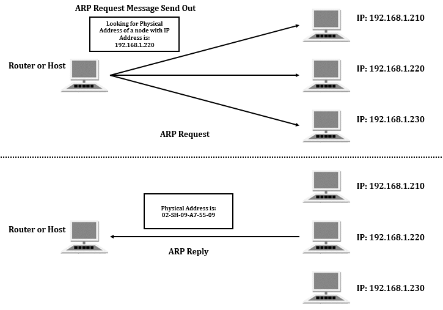

----

## In Code

<em>magic</em> code

<pre><code class="lang-javascript" style="font-size: 0.40em; line-height: 1.2em" data-trim data-noescape>
const raw = require('raw-socket')
const ip = require('ip')

function genTcp(srcIp, srcPort, destIp, destPort) {...}
function genIp(srcIp, srcPort, destIp, destPort) {...}

function sendSyn(srcIp, srcPort, destIp, destPort) {

  //          _,,,_                           _
  //         /////\\                    _ |\ | \|\  _
  //        // e e \\                  / `|~\|_/|~\|_) _
  //       ("   &gt;   ")    _            \_,         |_)|_)
  //        \\.=-=.//   \/ )     _ |\ /               | \|\
  //      \--\\\7///--/ /\/   _ |_)|~\                   |~\
  //      /`--`"""`--'\/ /   |_)| \
  //     /      :   \   / |\ |_)
  //     \  '-.,_    `-'  |~\
  //      `-._/__)======_____,
  //                  ((=====))
  //            _      |`"""`|    _//
  //       `\,_('&gt;     |=    |   (')
  //         \~_)      |=    |    ( '-.
  //         -'=       `-...-`   _/-_(_)o

  const ipBuffer = genIp(srcIp, srcPort, destIp, destPort)
  const tcpBuffer = genTcp(srcIp, srcPort, destIp, destPort)
  const buffer = Buffer.concat([ethBuffer, ipBuffer, tcpBuffer, ethTrail])
  socket.send(buffer, 0, buffer.length, destIp, beforeSend);

  // and that was just to send the first packet...
}
</code></pre>

----

## In Summary (Part 1)

HTTP is a message orientied protocol that is encapsulated by TCP, a connection-oriented protocol that allows for getting ordered streams of bytes, which is encapsulated IP, a message orientied protocol. IP is in turn encapsulated by Ethernet, which is another message oriented protocol.

Together, this whole structure defines something that can be sent over a network.

Ethernet gives us a mechanism for physically finding the next node to send to in a network, and also has some checksums to ensure valid data.

IP gives us a mechanism for addressing and some routing, while also ensuring it's headers aren't corrupted.

----

## In Summary (Part 2)

TCP ensures that all messages arrive in order and can detect most corruption.

HTTP uses TCP to send messages that takes a verb, an action, headers, and a body as a request.

It sends that data to a server, and the server returns with a response that includes a status code, headers, and a body.

The messages are directed to their final destination by IP packets, with ethernet frames being used for point to point communication between the origin address and the destination address.

Other things, like DNS, NAT and ARP make this work.

----

## That's it!
### HTTP, TCP, IP and Ethernet are fairly complex!

----

## Right?
### Well... We still don't know

- How does that data even make it to a wire?

---

# Network Cards

----

Now that we have this whole packet structure... how does it actually get communicated to a network card?

----

## DMA
### Direct Memory Access

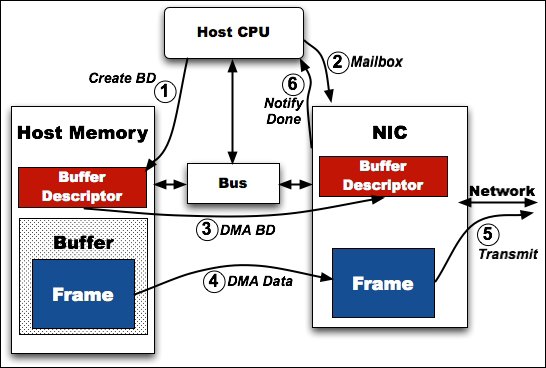

----

## In Code

<em>First we init our NIC...</em>

<pre><code class="lang-c" style="font-size: 0.20em; line-height: 1.2em" data-trim data-noescape>
...
// allocated for each tx queue, keeps state for the transmit function
struct ixgbe_tx_queue {
	volatile union ixgbe_adv_tx_desc* descriptors;
	uint16_t num_entries;
	// position to clean up descriptors that where sent out by the nic
	uint16_t clean_index;
	// position to insert packets for transmission
	uint16_t tx_index;
	// virtual addresses to map descriptors back to their mbuf for freeing
	void* virtual_addresses[];
};

// see section 4.6.4
static void init_link(struct ixgbe_device* dev) {
	// should already be set by the eeprom config, maybe we shouldn't override it here to support weirdo nics?
	set_reg32(dev->addr, IXGBE_AUTOC, (get_reg32(dev->addr, IXGBE_AUTOC) & ~IXGBE_AUTOC_LMS_MASK) | IXGBE_AUTOC_LMS_10G_SERIAL);
	set_reg32(dev->addr, IXGBE_AUTOC, (get_reg32(dev->addr, IXGBE_AUTOC) & ~IXGBE_AUTOC_10G_PMA_PMD_MASK) | IXGBE_AUTOC_10G_XAUI);
	// negotiate link
	set_flags32(dev->addr, IXGBE_AUTOC, IXGBE_AUTOC_AN_RESTART);
	// datasheet wants us to wait for the link here, but we can continue and wait afterwards
}
...

// it looks quite complicated in the data sheet, but it's actually really easy because we don't need fancy features
// see section 4.6.8
static void init_tx(struct ixgbe_device* dev) {
	// crc offload and small packet padding
	set_flags32(dev->addr, IXGBE_HLREG0, IXGBE_HLREG0_TXCRCEN | IXGBE_HLREG0_TXPADEN);

	// set default buffer size allocations
	// see also: section 4.6.11.3.4, no fancy features like DCB and VTd
	set_reg32(dev->addr, IXGBE_TXPBSIZE(0), IXGBE_TXPBSIZE_40KB);
	for (int i = 1; i < 8; i++) {
		set_reg32(dev->addr, IXGBE_TXPBSIZE(i), 0);
	}
	// required when not using DCB/VTd
	set_reg32(dev->addr, IXGBE_DTXMXSZRQ, 0xFFFF);
	clear_flags32(dev->addr, IXGBE_RTTDCS, IXGBE_RTTDCS_ARBDIS);

	// per-queue config for all queues
	for (uint16_t i = 0; i < dev->ixy.num_tx_queues; i++) {
		debug("initializing tx queue %d", i);

		// setup descriptor ring, see section 7.1.9
		uint32_t ring_size_bytes = NUM_TX_QUEUE_ENTRIES * sizeof(union ixgbe_adv_tx_desc);
		struct dma_memory mem = memory_allocate_dma(ring_size_bytes, true);
		memset(mem.virt, -1, ring_size_bytes);
		// tell the device where it can write to (its iova, so its view)
		set_reg32(dev->addr, IXGBE_TDBAL(i), (uint32_t) (mem.phy & 0xFFFFFFFFull));
		set_reg32(dev->addr, IXGBE_TDBAH(i), (uint32_t) (mem.phy >> 32));
		set_reg32(dev->addr, IXGBE_TDLEN(i), ring_size_bytes);
		debug("tx ring %d phy addr:  0x%012lX", i, mem.phy);
		debug("tx ring %d virt addr: 0x%012lX", i, (uintptr_t) mem.virt);

		// descriptor writeback magic values, important to get good performance and low PCIe overhead
		// see 7.2.3.4.1 and 7.2.3.5 for an explanation of these values and how to find good ones
		// we just use the defaults from DPDK here, but this is a potentially interesting point for optimizations
		uint32_t txdctl = get_reg32(dev->addr, IXGBE_TXDCTL(i));
		// there are no defines for this in ixgbe_type.h for some reason
		// pthresh: 6:0, hthresh: 14:8, wthresh: 22:16
		txdctl &= ~(0x3F | (0x3F << 8) | (0x3F << 16)); // clear bits
		txdctl |= (36 | (8 << 8) | (4 << 16)); // from DPDK
		set_reg32(dev->addr, IXGBE_TXDCTL(i), txdctl);

		// private data for the driver, 0-initialized
		struct ixgbe_tx_queue* queue = ((struct ixgbe_tx_queue*)(dev->tx_queues)) + i;
		queue->num_entries = NUM_TX_QUEUE_ENTRIES;
		queue->descriptors = (union ixgbe_adv_tx_desc*) mem.virt;
	}
	// final step: enable DMA
	set_reg32(dev->addr, IXGBE_DMATXCTL, IXGBE_DMATXCTL_TE);
}
</code></pre>

Note: adapted from https://github.com/emmericp/ixy

----

## More Code

<em>Just a bit more init...</em>

<pre><code class="lang-c" style="font-size: 0.20em; line-height: 1.2em;" data-trim data-noescape>
// see section 4.6.3
static void reset_and_init(struct ixgbe_device* dev) {
	info("Resetting device %s", dev->ixy.pci_addr);
	// section 4.6.3.1 - disable all interrupts
	set_reg32(dev->addr, IXGBE_EIMC, 0x7FFFFFFF);

	// section 4.6.3.2
	set_reg32(dev->addr, IXGBE_CTRL, IXGBE_CTRL_RST_MASK);
	wait_clear_reg32(dev->addr, IXGBE_CTRL, IXGBE_CTRL_RST_MASK);
	usleep(10000);

	// section 4.6.3.1 - disable interrupts again after reset
	set_reg32(dev->addr, IXGBE_EIMC, 0x7FFFFFFF);

	info("Initializing device %s", dev->ixy.pci_addr);

	// section 4.6.3 - Wait for EEPROM auto read completion
	wait_set_reg32(dev->addr, IXGBE_EEC, IXGBE_EEC_ARD);

	// section 4.6.3 - Wait for DMA initialization done (RDRXCTL.DMAIDONE)
	wait_set_reg32(dev->addr, IXGBE_RDRXCTL, IXGBE_RDRXCTL_DMAIDONE);

	// section 4.6.4 - initialize link (auto negotiation)
	init_link(dev);

	// section 4.6.5 - statistical counters
	// reset-on-read registers, just read them once
	ixgbe_read_stats(&dev->ixy, NULL);

	// section 4.6.7 - init rx
	init_rx(dev);

	// section 4.6.8 - init tx
	init_tx(dev);

	// enables queues after initializing everything
	for (uint16_t i = 0; i < dev->ixy.num_rx_queues; i++) {
		start_rx_queue(dev, i);
	}
	for (uint16_t i = 0; i < dev->ixy.num_tx_queues; i++) {
		start_tx_queue(dev, i);
	}

	// skip last step from 4.6.3 - don't want interrupts
	// finally, enable promisc mode by default, it makes testing less annoying
	ixgbe_set_promisc(&dev->ixy, true);

	// wait for some time for the link to come up
	wait_for_link(dev);
}

struct ixy_device* ixgbe_init(const char* pci_addr, uint16_t rx_queues, uint16_t tx_queues) {
	if (getuid()) {
		warn("Not running as root, this will probably fail");
	}
	if (rx_queues > MAX_QUEUES) {
		error("cannot configure %d rx queues: limit is %d", rx_queues, MAX_QUEUES);
	}
	if (tx_queues > MAX_QUEUES) {
		error("cannot configure %d tx queues: limit is %d", tx_queues, MAX_QUEUES);
	}

	// Allocate memory for the ixgbe device that will be returned
	struct ixgbe_device* dev = (struct ixgbe_device*) malloc(sizeof(struct ixgbe_device));
	dev->ixy.pci_addr = strdup(pci_addr);

	// Check if we want the VFIO stuff
	// This is done by checking if the device is in an IOMMU group.
	char path[PATH_MAX];
	snprintf(path, PATH_MAX, "/sys/bus/pci/devices/%s/iommu_group", pci_addr);
	struct stat buffer;
	dev->ixy.vfio = stat(path, &buffer) == 0;
	if (dev->ixy.vfio) {
		// initialize the IOMMU for this device
		dev->ixy.vfio_fd = vfio_init(pci_addr);
		if (dev->ixy.vfio_fd < 0) {
			error("could not initialize the IOMMU for device %s", pci_addr);
		}
	}
	dev->ixy.driver_name = driver_name;
	dev->ixy.num_rx_queues = rx_queues;
	dev->ixy.num_tx_queues = tx_queues;
	dev->ixy.rx_batch = ixgbe_rx_batch;
	dev->ixy.tx_batch = ixgbe_tx_batch;
	dev->ixy.read_stats = ixgbe_read_stats;
	dev->ixy.set_promisc = ixgbe_set_promisc;
	dev->ixy.get_link_speed = ixgbe_get_link_speed;

	// Map BAR0 region
	if (dev->ixy.vfio) {
		debug("mapping BAR0 region via VFIO...");
		dev->addr = vfio_map_region(dev->ixy.vfio_fd, VFIO_PCI_BAR0_REGION_INDEX);
	} else {
		debug("mapping BAR0 region via pci file...");
		dev->addr = pci_map_resource(pci_addr);
	}
	dev->rx_queues = calloc(rx_queues, sizeof(struct ixgbe_rx_queue) + sizeof(void*) * MAX_RX_QUEUE_ENTRIES);
	dev->tx_queues = calloc(tx_queues, sizeof(struct ixgbe_tx_queue) + sizeof(void*) * MAX_TX_QUEUE_ENTRIES);
	reset_and_init(dev);
	return &dev->ixy;
}
</code></pre>

----

## A bit more...

<em>Do our real work...</em>

<pre><code class="lang-c" style="font-size: 0.20em; line-height: 1.2em" data-trim data-noescape>
// section 1.8.1 and 7.2
// we control the tail, hardware the head
// huge performance gains possible here by sending packets in batches - writing to TDT for every packet is not efficient
// returns the number of packets transmitted, will not block when the queue is full
uint32_t ixgbe_tx_batch(struct ixy_device* ixy, uint16_t queue_id, struct pkt_buf* bufs[], uint32_t num_bufs) {
	struct ixgbe_device* dev = IXY_TO_IXGBE(ixy);
	struct ixgbe_tx_queue* queue = ((struct ixgbe_tx_queue*)(dev->tx_queues)) + queue_id;
	// the descriptor is explained in section 7.2.3.2.4
	// we just use a struct copy & pasted from intel, but it basically has two formats (hence a union):
	// 1. the write-back format which is written by the NIC once sending it is finished this is used in step 1
	// 2. the read format which is read by the NIC and written by us, this is used in step 2

	uint16_t clean_index = queue->clean_index; // next descriptor to clean up

	// step 1: clean up descriptors that were sent out by the hardware and return them to the mempool
	// start by reading step 2 which is done first for each packet
	// cleaning up must be done in batches for performance reasons, so this is unfortunately somewhat complicated
	while (true) {
		// figure out how many descriptors can be cleaned up
		int32_t cleanable = queue->tx_index - clean_index; // tx_index is always ahead of clean (invariant of our queue)
		if (cleanable &lt; 0) { // handle wrap-around
			cleanable = queue->num_entries + cleanable;
		}
		if (cleanable &lt; TX_CLEAN_BATCH) {
			break;
		}
		// calculcate the index of the last transcriptor in the clean batch
		// we can't check all descriptors for performance reasons
		int32_t cleanup_to = clean_index + TX_CLEAN_BATCH - 1;
		if (cleanup_to >= queue->num_entries) {
			cleanup_to -= queue->num_entries;
		}
		volatile union ixgbe_adv_tx_desc* txd = queue->descriptors + cleanup_to;
		uint32_t status = txd->wb.status;
		// hardware sets this flag as soon as it's sent out, we can give back all bufs in the batch back to the mempool
		if (status & IXGBE_ADVTXD_STAT_DD) {
			int32_t i = clean_index;
			while (true) {
				struct pkt_buf* buf = queue->virtual_addresses[i];
				pkt_buf_free(buf);
				if (i == cleanup_to) {
					break;
				}
				i = wrap_ring(i, queue->num_entries);
			}
			// next descriptor to be cleaned up is one after the one we just cleaned
			clean_index = wrap_ring(cleanup_to, queue->num_entries);
		} else {
			// clean the whole batch or nothing; yes, this leaves some packets in
			// the queue forever if you stop transmitting, but that's not a real concern
			break;
		}
	}
	queue->clean_index = clean_index;

	// step 2: send out as many of our packets as possible
	uint32_t sent;
	for (sent = 0; sent &lt; num_bufs; sent++) {
		uint32_t next_index = wrap_ring(queue->tx_index, queue->num_entries);
		// we are full if the next index is the one we are trying to reclaim
		if (clean_index == next_index) {
			break;
		}
		struct pkt_buf* buf = bufs[sent];
		// remember virtual address to clean it up later
		queue->virtual_addresses[queue->tx_index] = (void*) buf;
		volatile union ixgbe_adv_tx_desc* txd = queue->descriptors + queue->tx_index;
		queue->tx_index = next_index;
		// NIC reads from here
		txd->read.buffer_addr = buf->buf_addr_phy + offsetof(struct pkt_buf, data);
		// always the same flags: one buffer (EOP), advanced data descriptor, CRC offload, data length
		txd->read.cmd_type_len =
			IXGBE_ADVTXD_DCMD_EOP | IXGBE_ADVTXD_DCMD_RS | IXGBE_ADVTXD_DCMD_IFCS | IXGBE_ADVTXD_DCMD_DEXT | IXGBE_ADVTXD_DTYP_DATA | buf->size;
		// no fancy offloading stuff - only the total payload length
		// implement offloading flags here:
		// 	* ip checksum offloading is trivial: just set the offset
		// 	* tcp/udp checksum offloading is more annoying, you have to precalculate the pseudo-header checksum
		txd->read.olinfo_status = buf->size &lt;&lt; IXGBE_ADVTXD_PAYLEN_SHIFT;
	}
	// send out by advancing tail, i.e., pass control of the bufs to the nic
	// this seems like a textbook case for a release memory order, but Intel's driver doesn't even use a compiler barrier here
	set_reg32(dev->addr, IXGBE_TDT(queue_id), queue->tx_index);
	return sent;
}
</code></pre>

----

## In Summary (Part 1)

HTTP is a message orientied protocol that is encapsulated by TCP, a connection-oriented protocol that allows for getting ordered streams of bytes, which is encapsulated IP, a message orientied protocol. IP is in turn encapsulated by Ethernet, which is another message oriented protocol.

Together, this whole structure defines something that can be sent over a network, via a kernel network driver, which builds ring buffers of packets to be sent, which are by a NIC using DMA, which then sends the data on to the actual network by writing signals to a wire.

----

## In Summary (Part 2)

Ethernet gives us a mechanism for physically finding the next node to send to in a network, and also has some checksums to ensure valid data.

IP gives us a mechanism for addressing and some routing, while also ensuring it's headers aren't corrupted.

TCP ensures that all messages arrive in order and can detect most corruption.

----

## In Summary (Part 3)

HTTP uses TCP to send messages that takes a verb, an action, headers, and a body as a request.

It sends that data to a server, and the server returns with a response that includes a status code, headers, and a body.

The messages are directed to their final destination by IP packets, with ethernet frames being used for point to point communication between the origin address and the destination address.

Other things, like DNS, NAT and ARP make this work.

----

## That's it!
### HTTP, TCP, IP, Ethernet and NICs are a huge system to do something we see as "simple"

---

# Hooray! We know things work...
## Sorta <!-- .element: class="fragment" data-fragment-index="1" -->

---

# Still a few things to understand though

----

## Speeding up ethernet

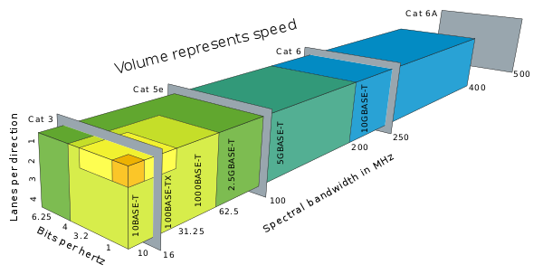

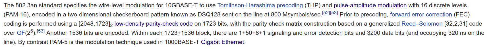

----

## Make sure we understand OSPF real quick

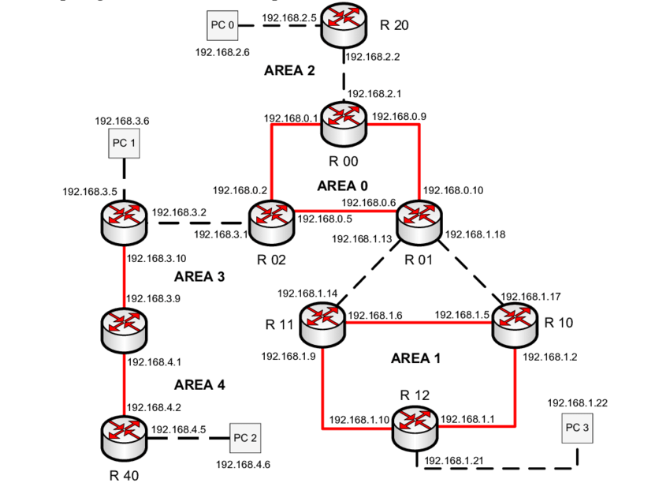

----

## A bit of BGP

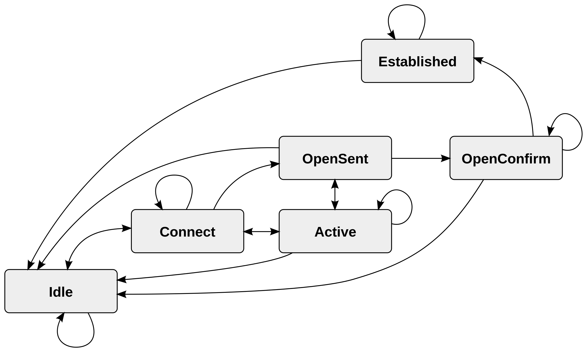

----

## TLS is sorta important

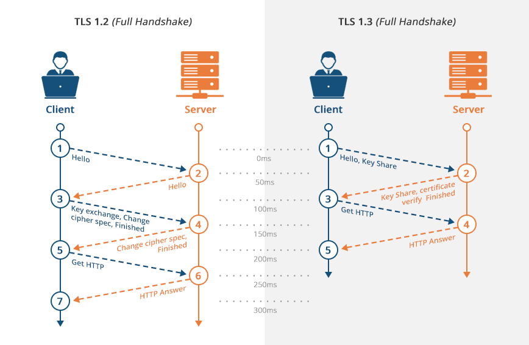

----

## HTTP/2 is the future

----

## HTTP/3 is the future-future

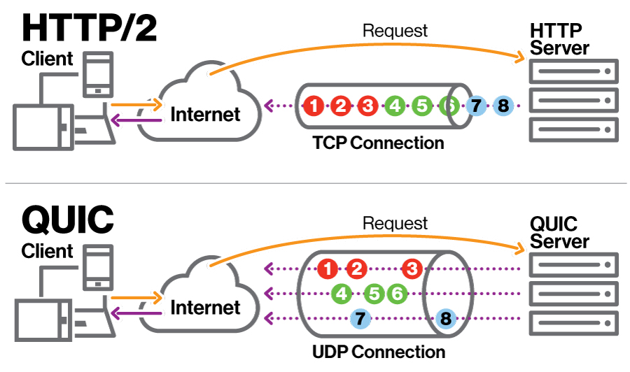

----

## Enter UDP

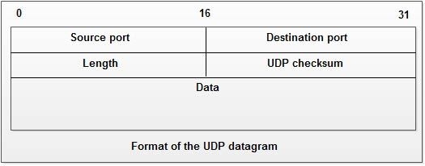

----

## Wi-Fi is nice to have

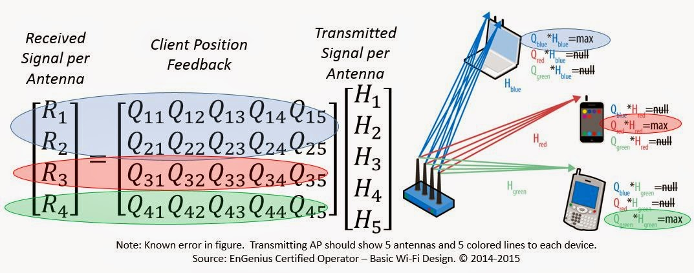

----

## LTE and 5g are pretty popular

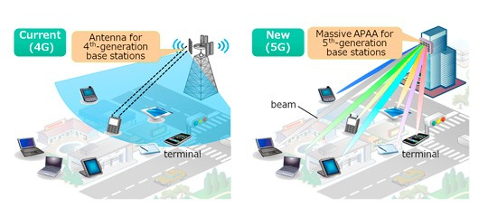

----

## IPv6 is important

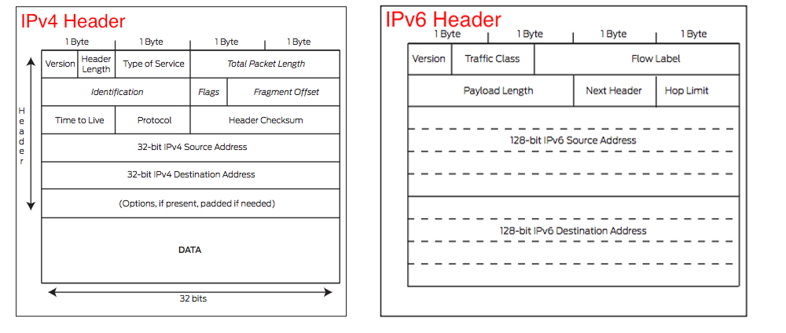

----

## Not to mention a million other concerns

- Latency
- Performance
- Security
- Predictability

----

## In Summary

---

---

## It is a wonder anything ever works at all
### But it does <!-- .element: class="fragment" data-fragment-index="1" -->

---

## How do we build systems that are as ambitious as the internet is?

----

### How do we deal with complexity?

<h3 class="fragment">¯\\_(ツ)_/¯ </h3>

----

## There might be a few lessons we could learn though

----

### How to model

----

### How to layer

Not all of these abstractions are completely opaque

NOTE: example, TCP knows about IP and IP knows about TCP

----

### How to group and seperate concerns

Some problems are best solved in one place and one place only (routing) others
are stratified throughout the entire stack (error correction)

----

### Patience to evolve

It took us 30 years to get where we are today, how do we give more technologies the chance to evolve

----

### Resources to make change

We still have things we need to fix, continued investment is critical

---

# Thanks!
